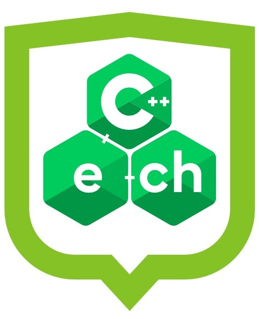

<!-- Barvou nadpisů první a druhé úrovně je _tmavá zelená_ z vizuálního stylu
používaného do r. 2025. Nová tmavá zelená je na většíně projektorů špatně vidět.
Často málo kontrastuje s bílou -->

# What is a HashDoS attack  

## and how to mitigate it in C++

---

<!-- Odtud začínají být vidět čísla slidů -->
<!-- paginate: true -->

## Table of Contents

1. A short story – how it all began  
2. What is HashDoS? – theory & terms
3. Demo
4. Mitigation in C++
5. Resources & links

---

# 1. A short story

### The origin of HashDoS

- ⚠️ First disclosed publicly in **2011**
- Demonstrated by **Alexander Klink & Julian Wälde** at 28C3
- Affected major platforms: **PHP, Python, Java, ASP.NET…**
- Real-world risk: **web servers unresponsive** with small crafted payloads
- Prompted emergency security patches in major ecosystems

[HashDoS disclosure (oCERT)](https://ocert.org/advisories/ocert-2011-003.html)

---

## 2. What is HashDoS?

### Key concepts

- **Hashing** – transforming input into a fixed-size value
- **Hash collisions** – different inputs produce the same hash
- **Hash-based collections** – like `std::unordered_map`
- **HashDoS** – Denial of Service via excessive collisions

---

## 2. HashDoS Attack Mechanism

### What’s happening under the hood

- Attacker sends many colliding keys
- Hash table becomes unbalanced
- Lookup times degrade from O(1) to O(n)
- Server resources are exhausted

---

## 3. Demo

### Simulating a HashDoS attack

---

## Demo Setup

- Built with xmake (thanks to Michal Žamboch)
- Using my own HTTP server (using httplib package)
- Using Postman to send requests

---

## First: demonstrating hash collisions

- All hash functions have collisions
- The question is: how hard are they to find?

---

## Simulating the HashDoS attack

- Using a bad hash function: only first 6 characters
- Easy to create **multi-collisions**
- Inputs with same hash value → stress the server

---

## 4. How to mitigate HashDoS in C++

### Best practices

- ✅ Use 64-bit apps – wider `size_t`, more entropy
- ✅ Sanitize input – whitelist values, limit sizes
- ✅ Use beter hash functions if needed and seed it (xxHash, siphash)
- ✅ Use collections **not based on hashes** – e.g. `std::map`, `std::multimap`

---

## 5. C++ Associative Containers

| Container                 | Type      | Ordering | Duplicate Keys | Lookup | Hash-based |
|---------------------------|-----------|----------|----------------|--------|------------|
| `std::unordered_map`      | Unordered | No       | No             | O(1)*   | ✅        |
| `std::unordered_multimap` | Unordered | No       | Yes            | O(1)*   | ✅        |
| `std::map`                | Ordered   | Yes      | No             | O(log n) | ❌        |
| `std::multimap`           | Ordered   | Yes      | Yes            | O(log n) | ❌        |

\* Average-case complexity; can degrade to O(n) under collisions

---

## 6. Resources & Links

- [Hash DoS Attack | PPT](https://www.slideshare.net/slideshow/hash-dos-attack/30145445)
- [Collision Attack - Wikipedia](https://en.wikipedia.org/wiki/Collision_attack)
- [SipHash - Wikipedia](https://en.wikipedia.org/wiki/SipHash)
- [MurmurHash - Wikipedia](https://en.wikipedia.org/wiki/MurmurHash)
- [Breaking Hash Functions - orlp.net](https://orlp.net/blog/breaking-hash-functions/)
- [CVE-2011-3414 - Microsoft Security](https://learn.microsoft.com/en-us/security-updates/securitybulletins/2011/ms11-100#collisions-in-hashtable-may-cause-dos-vulnerability---cve-2011-3414)

---

## Thank you

### Questions?
