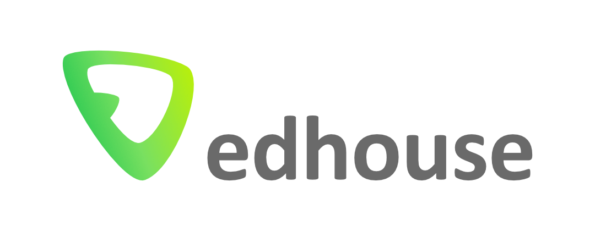

<!-- Barvou nadpisů první a druhé úrovně je _tmavá zelená_ z vizuálního stylu
používaného do r. 2025. Nová tmavá zelená je na většíně projektorů špatně vidět.
Často málo kontrastuje s bílou -->
<style>
img[alt~="logo"] {
  position: absolute;
  top: 10px;
  right: 10px;
  width: 210px;
}

h1 {
    color: #009645
}

h2 {
    color: #009645
}

pre {
    background: #f8f8f8
}

img[alt~="title-image"] {
  position: absolute;
  top: 500px;
  right: 70px;
  width: 180px;
}
</style>



# %Titulek prezentace%


%Podtitulek, pokud je potřeba%

---

<!-- Odtud začínají být vidět čísla slidů -->
<!-- paginate: true -->


## %Agenda%

%Bod krátkého vysvětlení o čem bude tato prezentace%

%Bod krátkého vysvětlení o čem bude tato prezentace%

%Bod krátkého vysvětlení o čem bude tato prezentace%

1. %Titulek části prezentace%
2. %Titulek části prezentace%
3. %Titulek části prezentace%

---

<!-- _footer: %Speciální zápatí pro tento slide, např. linkedin username% -->


## %Autor%

<style>
img[alt~="author-secondary"] {
  position: absolute;
  top: 450px;
  right: 100px;
  width: 200px
}
</style>

- %Bod představení autora%
- %Bod představení autora%
- %Bod představení autora%
- %Bod představení autora%


---

## %Slide s obrázkem a textem%

%Prvních několik bodů%:

- %Bod%
- %Bod%
- %Bod%

%Dalších několik bodů%:

- %Bod%
- %Bod%
- %Bod%


---

<style>
img[alt~="qr"] {
  position: absolute;
  top: 240px;
  right: 500px;
  width: 250px
}
</style>


## 1. %Titulek části prezentace%

%Podtitulek, pokud je potřeba%

---


## %Slide pouze s kódem%

```rust
fn f(n_container: Arc<Mutex<i32>>) {
    let mut n_ref = n_container.lock().expect("Lock is not poisoned");
    *n_ref += 1;
}

fn main() {
    let n_container = Arc::new(Mutex::new(0i32));
    let container_clone = n_container.clone();
    let my_thread = std::thread::spawn(move || {
        f(container_clone);
    });
    _ = my_thread.join();
    let n_ref = n_container.lock().expect("Lock not poisoned");
    println!("{}", *n_ref);
}
```

---

## %Slide pouze s textem%


- %První bod textu%
- %Druhý bod textu%
- %Bod s pododrážkami%
  - %První pododrážka, kde jsou i výrazy z kódu jako `while`, `int` a `foreach`%
  - %Druhá pododrážka, kde jsou i emoji 🎤, 🔊, 💯%
- %Poslední bod textu%

---

## %Slide s textem a plovoucím obrázkem%


<style>
img[alt~="floating-image"] {
  position: absolute;
  top: 390px;
  right: 140px;
  width: 250px
}
</style>

- %První bod textu%
- %Druhý bod textu%
- %Bod s pododrážkami%
  - %První pododrážka
  - %Druhá pododrážka
- %Poslední bod textu%


---


## %Slide s kódem a textem%

```rust
#[derive(Serialize)]
struct BeepEventData {
    counter_value: u32,
}
```

- %První komentář kódu%
- %Druhý komentář kódu%
- %Třetí komentář kódu%

---

<!-- Obrázek přes celý slide -->


---

<!-- Dva obrázky přes celý slide -->


