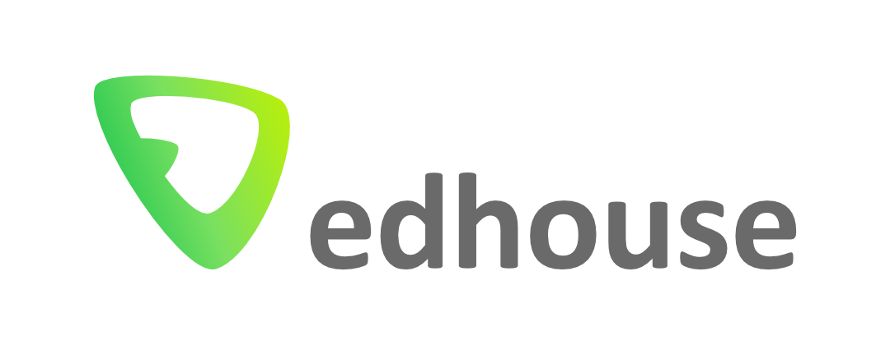

<!-- Barvou nadpisů první a druhé úrovně je _tmavá zelená_ z vizuálního stylu
používaného do r. 2025. Nová tmavá zelená je na většíně projektorů špatně vidět.
Často málo kontrastuje s bílou -->

# Tracy

And profiling in general

---

<!-- Odtud začínají být vidět čísla slidů -->
<!-- paginate: true -->

## TOC

1. Story - the origin of this talk

1. Tracy - what is it, how to use it

1. Demo

1. Sources

---

## Story of Jindra & Pavel

### Jindra - searching for a profiling tool

### Pavel - having a good profiling tool

---

## Tracy

*Profiling tool worth trying*

* sample based profiling tools / instrumentation based
  * automatic instrumentation
* Tracy can do both but the latter is more interesting
* Super easy setup (in C++)
* Low latency (they say)
* Nice visualization tool (a bit slowish though)

---

## Tracy

### Architecture

* Client - Server
  * Any client can be made
* The software being profiled acts as a client
* Server catches the traces
* [An Introduction to Tracy Profiler in C++ - Marcos Slomp - CppCon 2023 5:20](https://youtu.be/ghXk3Bk5F2U?si=6vd4KmWLJ-yVbdgU&t=320)

---

## Tracy

### Setup

* Responsible vs guerilla approach
* `Tracy.hpp`, `TracyClient.cpp`, `TRACY_ENABLE`
* [An Introduction to Tracy Profiler in C++ - Marcos Slomp - CppCon 2023 15:30](https://youtu.be/ghXk3Bk5F2U?si=6vd4KmWLJ-yVbdgU&t=930)
* Rust is a bit different story

---

## Tracy

### Traces

* ZoneScoped
* RAII
* [An Introduction to Tracy Profiler in C++ - Marcos Slomp - CppCon 2023 18:52](https://youtu.be/ghXk3Bk5F2U?si=6vd4KmWLJ-yVbdgU&t=1132)

---

## DEMO

### Quant

---

## Sources

* <https://github.com/wolfpld/tracy>
* <https://youtu.be/ghXk3Bk5F2U?si=6vd4KmWLJ-yVbdgU> - An Introduction to Tracy Profiler in C++ - Marcos Slomp - CppCon 2023
* <https://github.com/nagisa/rust_tracy_client> - Rust Tracy client
* <https://github.com/marekpsenka/edhouse-marp-template> - Template of this slide deck
* <https://github.com/tencek/talks/tree/main/tracy> - This talk
